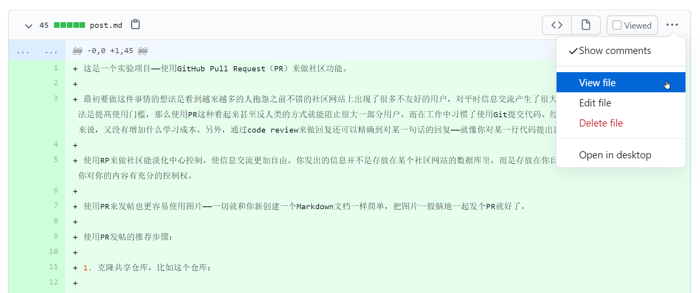

这是一个实验项目——使用GitHub Pull Request（PR）来做社区功能。

最初要做这件事情的想法是看到越来越多的人抱怨之前不错的社区网站上出现了很多不友好的用户，对平时信息交流产生了很大的困扰。过滤用户的一种有效做法是提高使用门槛，那么使用PR这种看起来甚至反人类的方式就能阻止很大一部分用户。而在工作中习惯了使用Git提交代码、经常做code review工作的小伙伴来说，又没有增加什么学习成本。另外，通过code review来做回复还可以精确到对某一句话的回复——就像你对某一行代码提出建议一样。

使用RP来做社区能淡化中心控制，使信息交流更加自由。你发出的信息并不是存放在某个社区网站的数据库里，而是存放在你自己的GitHub账号控制的仓库里——你对你的内容有充分的控制权。

使用PR来发帖也更容易使用图片——一切就和你新创建一个Markdown文档一样简单，把图片一股脑地一起发个PR就好了。

使用PR发帖的推荐步骤：

1. 克隆共享仓库，比如这个仓库：

   ```
   git clone https://github.com/letsscrum/scrum.git
   ```

2. 在默认分支的基础上创建新的分支——每一次发帖都要创建一个新的分支，否则会在你之前的PR基础上提交新的内容——这应该不是你想看到的，因为这样会把两个不同的帖子混在一起——不过当然，一切都由你说了算。

   ```
   git checkout -b new-branch
   ```

3. 为新文件创建一个新的commit，然后推送到GitHub上。别忘了用帖子标题做commit message，这样能把标题直接显示在PR的标题里——当然你也可以去GitHub上更改。

   ```
   git add .
   git commit -m "帖子标题"
   git push -u origin new-branch
   ```

4. 向原仓库发起PR

当你不希望对你发的某个帖子继续进行讨论了，直接关掉那个PR就好了。

查看PR帖子的推荐步骤：

1. 浏览共享仓库的PR列表，比如这个仓库：https://github.com/letsscrum/scrum/pulls

2. 切换到Files changed标签，选择View file

   

这还是一个实验性的项目，目前还很难预测这种交流方式的效率怎么样，不过尝试新的东西总是让人既兴奋又激动的。

在之后的一段时间里我会尝试着用这种方式在这个共享仓库里分享一些我的发现和想法，也欢迎所有能看见这个帖子的朋友一起加入进来——不要有任何疑虑，所有人都可以发PR。